# Mail

## Mail Selection

[Gmail](#gmail)
[Thunderbird](#thunderbird)

### Interface Web

https://roundcube.telecomnancy.eu/
https://webmail.telecomnancy.eu/SOGo/so/

LoginUL
MotDePasseDeL'UL

### Connecter sa .eu à Gmail ou Thunderbird

#### Gmail

Aller dans les paramètres de gmail

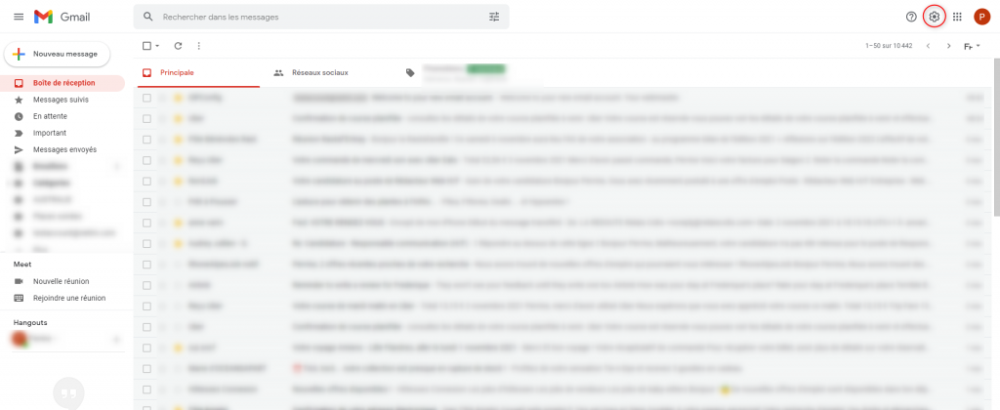

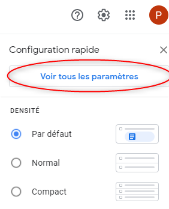

Aller dans l'onglet *Comptes et importation* dans la section *Consulter d'autres comptes de messagerie*

Cliquer sur *Ajouter un compte de messagerie*

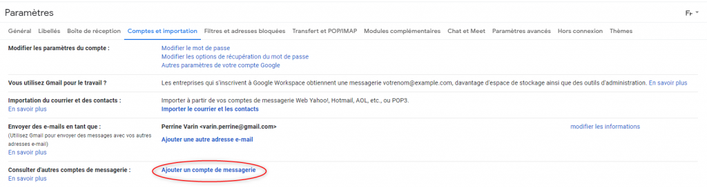

Entrer votre adresse mail de Télécom Nancy (Exemple : baptiste.jullien@telecomnancy.eu)

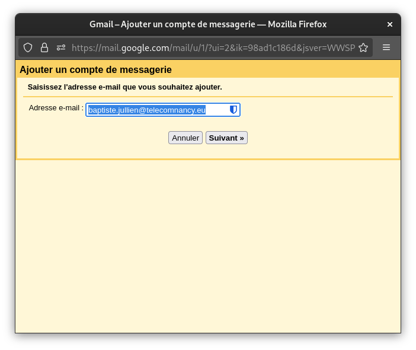

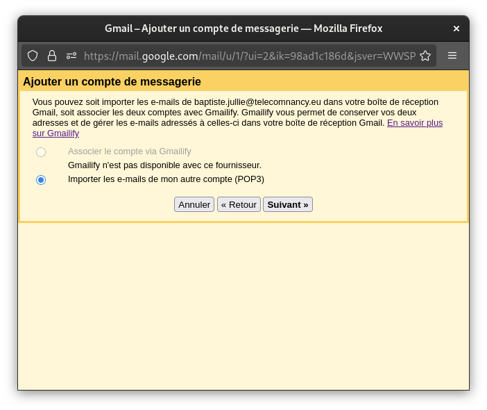

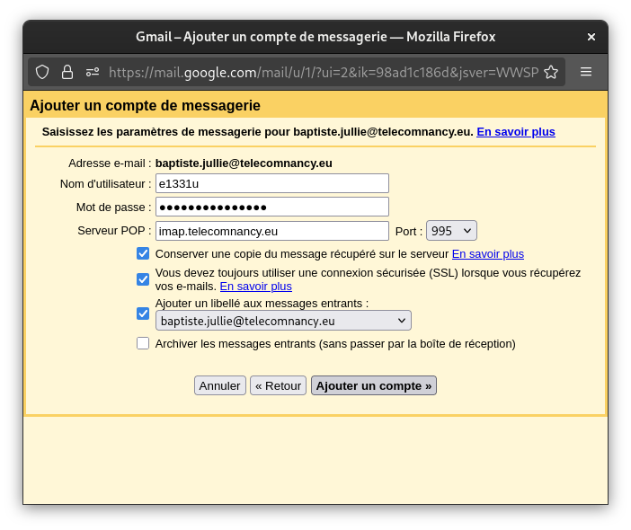

Pour envoyé des mail avec ta *@telecomnancy.eu*

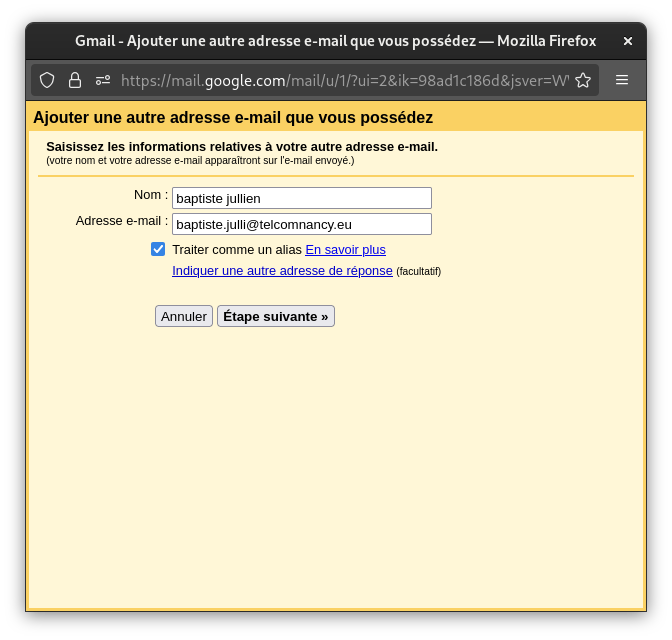

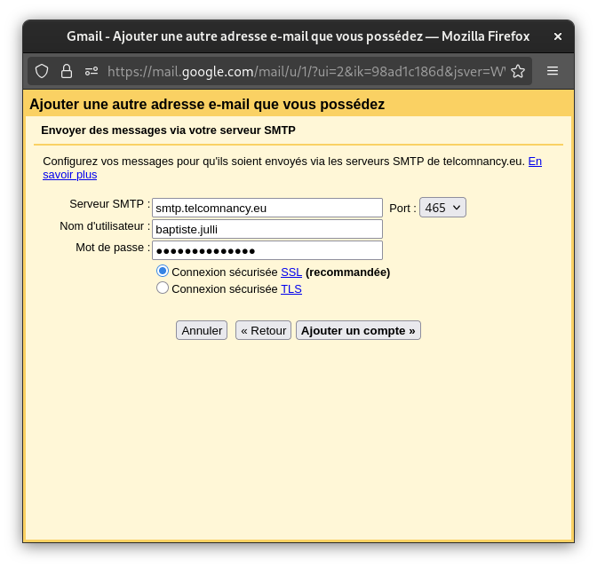

#### Thunderbird

On clique sur la roue cranté en bas à droite
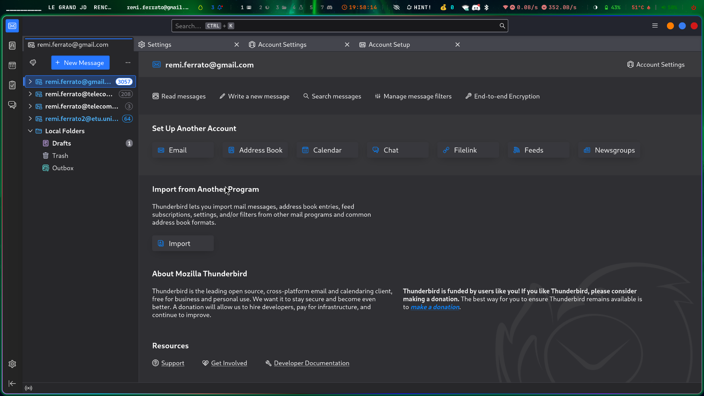
On va dans account settings puis add mail account

On remplie ces creds
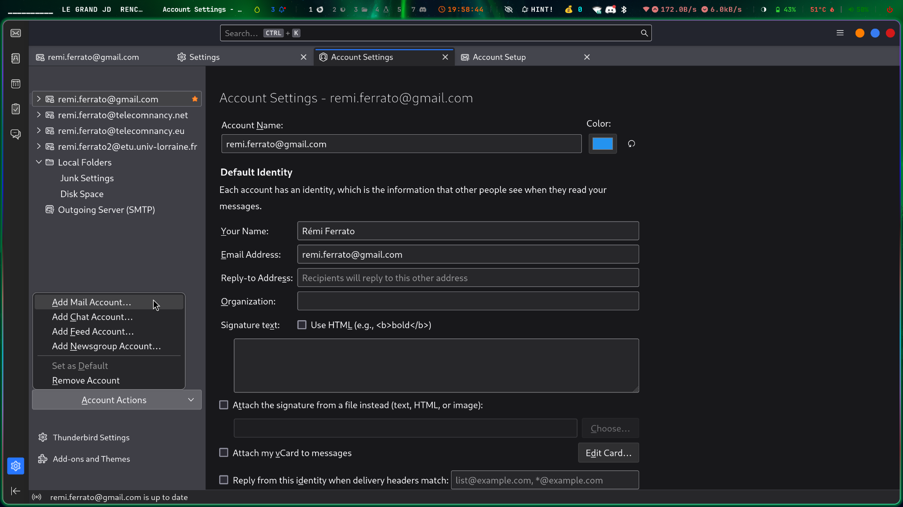
On clique sur configure manualy
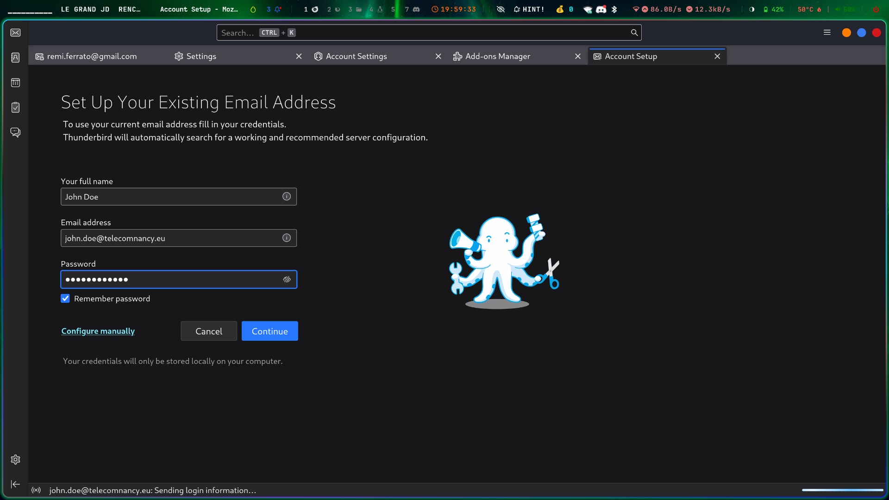
On remplie les paramètres
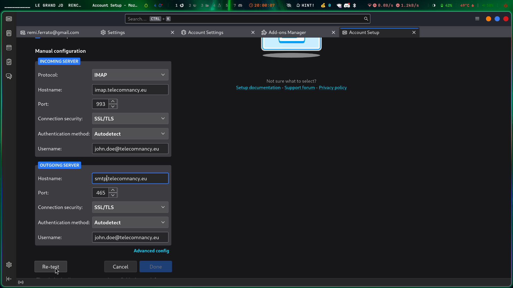
On appuie sur test, et si c'est bon, on clique sur done
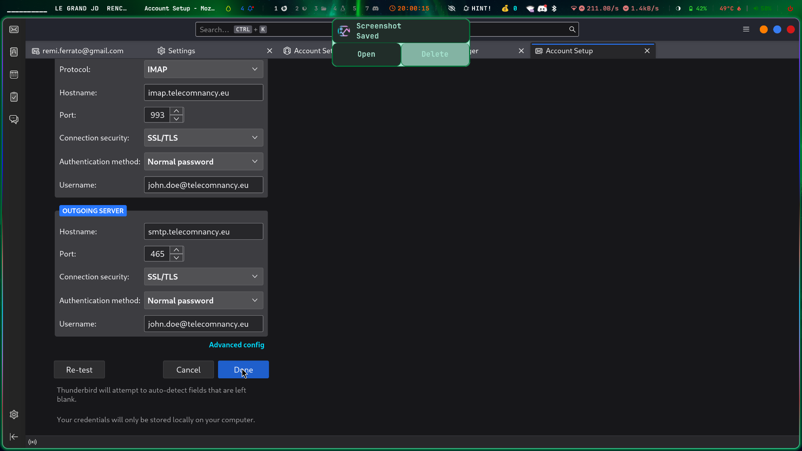

## Mail de L'UL

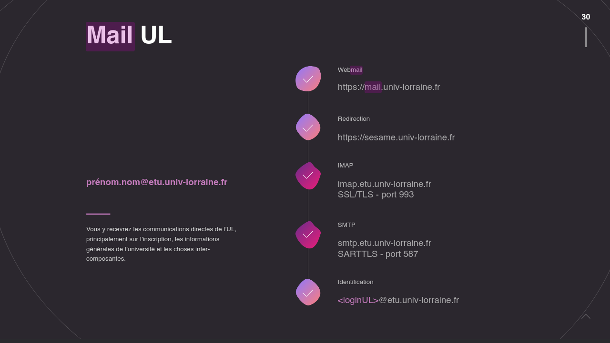

### Interface Web

https://mail.univ-lorraine.fr/

### Redirection

Mettez un redirection vers l'adresse mail de votre choix
https://sesame.univ-lorraine.fr/account/redirection

### Connexion

Si vous avez besoin de vous connecter voici les informations

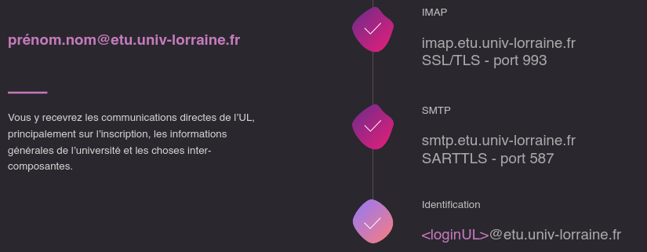

prénom.nom@etu.univ-lorraine.fr

#### IMAP
imap.etu.univ-lorraine.fr
SSL/TLS - port 993

#### SMTP
smtp.etu.univ-lorraine.fr
SARTTLS - port 587

#### Identification
"loginUL"@etu.univ-lorraine.fr

## Source 

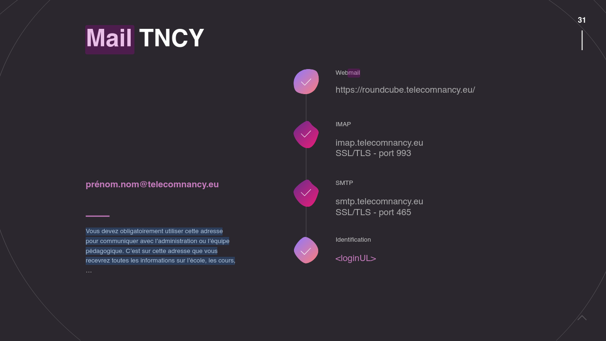
